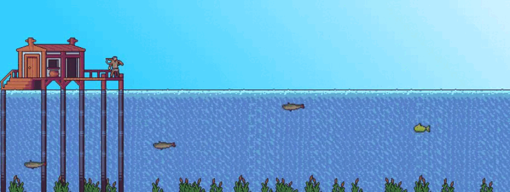
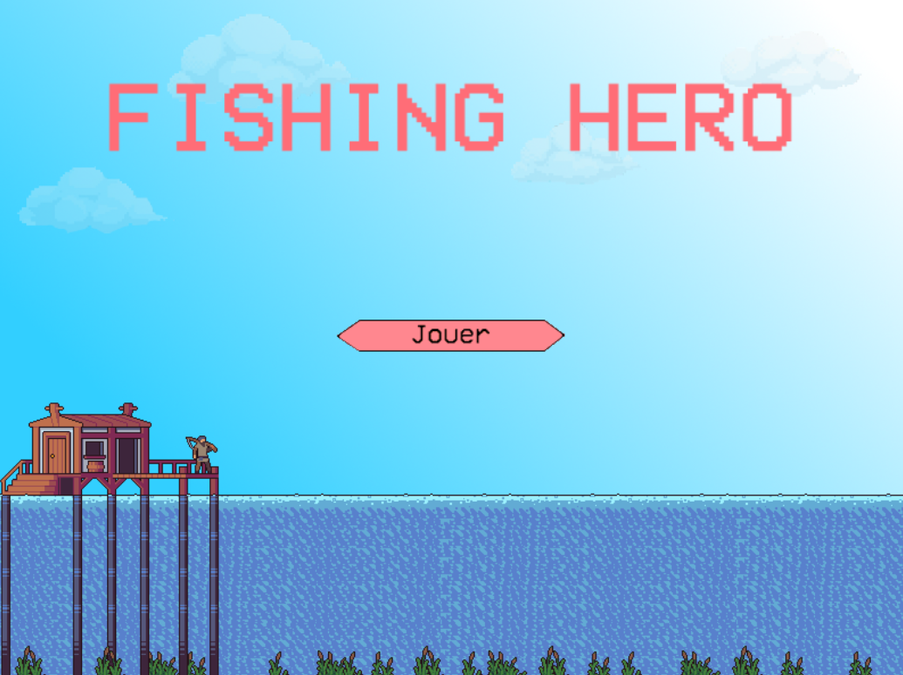
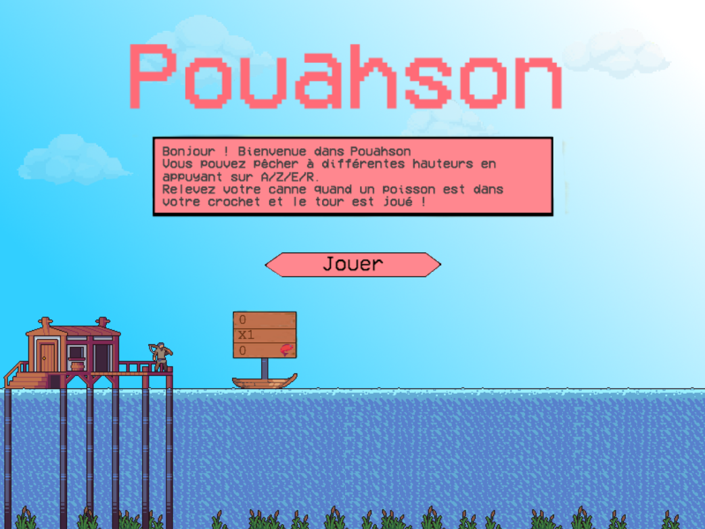

# Projet de jeu PHASER

Phaser est un framework de jeu 2D utilisé pour créer des jeux en HTML5. Il utilise à la fois un moteur de rendu Canvas et WebGL.

Démo jouable à cette adresse : 
https://cdrcmag.github.io/WEB_Phaser_ProjetA/

## Résumé

Bob le pêcheur pêche tranquillement sur son ponton lorsqu’il se sent investi par l’esprit du groove. Il décide alors de pêcher ses poissons sur un rythme endiablé.

## Notes

### Au 26/11/21
- Rédaction du <a href="Captures/Maggay_Web_ProjetPhaser.pdf">concept</a>
- Mise en place de l'environnement de jeu
- Prise en main du framework
- Début prototypage
- Implémentation basique de la direction artistique
- Développement core gameplay (pêcher à différentes hauteurs)

<table>
	<tr>
		<td></td>
		<td></td>
	</tr>
</table>

### Au 03/12/21
- Ajout du crochet 
- Collisions entre le crochet et les poissons
- Système d'apparition des poissons 
- Nommage des poissons pour différentiation (Paul, Britney, Kimberly et Marcus)
- Ajout des animations pour les 4 types de poissons
- Démo du jeu avec apparition aléatoire des poissons
- Ajout de décorations
- Fix de divers bugs dans le core gameplay
- Ajout du score
- Mise à jour globale du code

- Ajout du menu principal et capacité à lancer une partie
- Developpement du score, multiplicateurs, tracking de stats (nombre de poissons touchés, nombre ratés, etc..)

### Au 11/12/21
- Ajout de sons
- Fix de divers bugs
- Ajout d'une bulle tutoriel
- Mise à jour du titre et concept du jeu
- Ajout de recap de fin de partie
- Ajout d'un panneau de stats lors d'une partie

