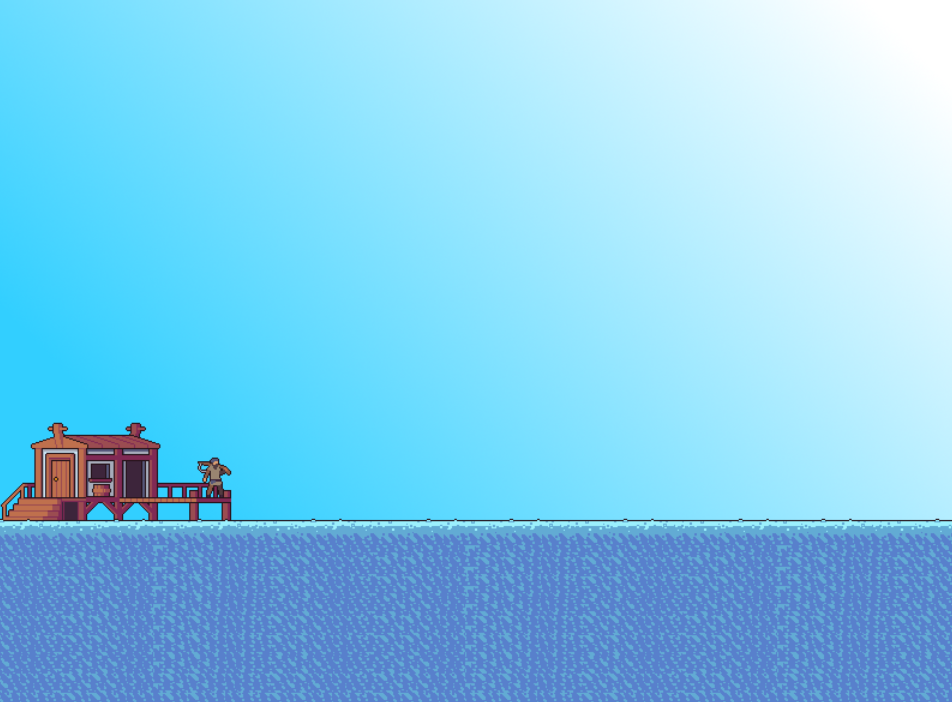

# Projet de jeu PHASER

Phaser est un framework de jeu 2D utilisé pour créer des jeux en HTML5. Il utilise à la fois un moteur de rendu Canvas et WebGL.

## Résumé

Bob le pêcheur pêche tranquillement sur son ponton lorsqu’il se sent investi par l’esprit du groove. Il décide alors de pêcher ses poissons sur un rythme endiablé.

## Notes

### Au 26/11/21
- Rédaction du concept //link
- Mise en place de l'environnement de jeu
- Prise en main du framework
- Début prototypage
- Implémentation basique de la direction artistique
- Développement core gameplay (pêcher à différentes hauteurs)

### Au 03/12/21

### Au 11/12/21